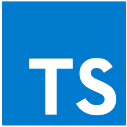

# CURSO DE TYPESCRIPT
👨‍⚖️TYPESCRIPT É UMA LINGUAGEM DE PROGRAMAÇÃO.

  

## VISÃO PANORÂMICA:
| PERGUNTA | RESPOSTA |
| :---: | :---: |
| DATA DE CRIAÇÃO | 2012 |
| NOME DO CRIADOR | Microsoft | 
| SIGNIFICADO DO NOME | O nome "TypeScript" refere-se à capacidade da linguagem de adicionar tipagem estática ao JavaScript |
| É BASEADA NO | JavaScript |
| EXTENÇÃO DO ARQUIVO | .ts |
| É MAIS USADA | Desenvolvimento web (FrontEnd) |

O TypeScript foi desenvolvido pela Microsoft. A primeira versão pública do foi lançada em outubro de 2012. O nome "TypeScript" refere-se à capacidade da linguagem de adicionar tipagem estática ao JavaScript, tornando-o mais seguro e previsível para o desenvolvimento de software. Ela é uma extensão do JavaScript. Isso significa que ele é baseado no JavaScript e pode ser considerado um superset da linguagem, adicionando funcionalidades de tipagem estática. Os arquivos geralmente têm a extensão ".ts". Por exemplo, "meuArquivo.ts". Ela é amplamente utilizado para o desenvolvimento de aplicativos da web, especialmente em projetos de grande escala. Ele é popular em ambientes de desenvolvimento front-end, onde é comumente usado com bibliotecas e frameworks como Angular, React e Vue.js. Além disso, também é utilizado no desenvolvimento back-end com Node.js, e em muitas outras áreas de desenvolvimento de software devido à sua capacidade de melhorar a segurança e a manutenção do código.

## SUA HISTÓRIA:
Sua história remonta a 2012, quando Anders Hejlsberg, conhecido por seu trabalho na criação do Turbo Pascal, Delphi e C#, liderou a equipe de desenvolvimento da Microsoft que começou a trabalhar no projeto.

O TypeScript foi projetado como uma linguagem que estende o JavaScript adicionando tipos estáticos opcionais e outros recursos avançados, mantendo compatibilidade total com o JavaScript existente. Ele foi desenvolvido para abordar algumas das limitações do JavaScript na construção de aplicativos em grande escala, oferecendo aos desenvolvedores ferramentas para escrever código mais robusto e escalável.

Em 1º de outubro de 2012, a Microsoft anunciou o TypeScript pela primeira vez em um post de blog. Em 1º de outubro de 2012, a Microsoft anunciou o TypeScript pela primeira vez em um post de blog. O TypeScript 0.8 foi lançado em 1º de outubro de 2012, marcando o início do desenvolvimento público da linguagem. Desde então, o TypeScript evoluiu significativamente, com várias versões lançadas e uma crescente base de usuários e comunidade de desenvolvedores.

Em 2015, a Microsoft anunciou que o Angular 2, uma importante estrutura de desenvolvimento web, seria reescrito em TypeScript, o que ajudou a impulsionar a popularidade da linguagem. Além disso, o TypeScript foi adotado por várias outras empresas e organizações, incluindo Google, Airbnb, Slack e outros, que reconheceram seus benefícios na construção de aplicativos web complexos e de grande escala.

Atualmente, o TypeScript é amplamente utilizado no desenvolvimento web, especialmente em projetos baseados em Angular, React e Node.js. Ele oferece aos desenvolvedores uma maneira poderosa de escrever código JavaScript mais seguro e mais fácil de manter, enquanto continua a evoluir com o suporte de uma comunidade ativa de desenvolvedores e contribuidores.

## DIFERENÇAS PARA O JAVASCIPT:
O TypeScript é uma linguagem que se baseia no JavaScript, mas adiciona características exclusivas que o tornam distinto e valioso para muitos desenvolvedores. Aqui estão algumas das características que tornam o TypeScript único em comparação com o JavaScript:

1. **Tipagem Estática Opcional**:
   - O TypeScript permite a definição de tipos de dados para variáveis, parâmetros de função e valores de retorno de função.
   - Isso ajuda a capturar erros de tipo em tempo de compilação, o que pode aumentar a robustez do código e facilitar a manutenção.

2. **Inferência de Tipo**:
   - O TypeScript é capaz de inferir tipos automaticamente, reduzindo a necessidade de declarações explícitas de tipos em muitos casos.
   - Isso combina o benefício da tipagem estática com a flexibilidade da tipagem dinâmica do JavaScript.

3. **Intellisense e Ferramentas de Desenvolvimento**:
   - O TypeScript oferece suporte a recursos avançados de Intellisense em IDEs como o Visual Studio Code, tornando o desenvolvimento mais produtivo.
   - Com as informações de tipo disponíveis, as ferramentas de desenvolvimento podem oferecer sugestões de código e detecção de erros em tempo real.

4. **Interfaces e Tipos Personalizados**:
   - O TypeScript permite a criação de interfaces e tipos personalizados, o que facilita a descrição da forma de objetos complexos e a reutilização de tipos personalizados em vários lugares do código.

5. **Checagem de Nulos e Indefinidos Mais Segura**:
   - O TypeScript introduz conceitos como `null` e `undefined` como tipos específicos.
   - Isso ajuda a evitar muitos erros comuns relacionados a valores nulos ou indefinidos.

6. **Enums**:
   - Enums (enumerações) são um tipo de dado que facilita a representação de conjuntos de valores nomeados.
   - Isso torna o código mais legível e menos suscetível a erros de digitação.

7. **Decorators**:
   - O TypeScript oferece suporte a decoradores, que são usados para adicionar metadados a classes, métodos, propriedades e parâmetros de função.
   - Os decoradores são comumente usados em estruturas de aplicativos, como o Angular, para adicionar funcionalidades personalizadas.

8. **Aprimoramento da Produtividade**:
   - O TypeScript pode aumentar a produtividade da equipe de desenvolvimento, especialmente em projetos grandes e complexos, ao fornecer mais informações sobre o código durante o desenvolvimento.

9. **Compatibilidade com JavaScript**:
   - O TypeScript é uma extensão do JavaScript e é totalmente compatível com o código JavaScript existente.
   - Você pode gradualmente adotar TypeScript em projetos JavaScript existentes e aproveitar seus recursos adicionais.

10. **Comunidade e Ecossistema**:
    - O TypeScript tem uma comunidade ativa e crescente e um ecossistema robusto de bibliotecas e ferramentas de desenvolvimento.
    - É amplamente adotado por grandes empresas e projetos de código aberto, o que aumenta a disponibilidade de recursos e suporte.

## CARACTERISTICAS:
### POSITIVAS:
1. **Tipagem Estática Opcional**: O TypeScript permite a definição de tipos de dados para variáveis, parâmetros de função e valores de retorno de função, o que ajuda a capturar erros de tipo em tempo de compilação e a aumentar a segurança e a robustez do código. No entanto, a tipagem é opcional, permitindo flexibilidade quando necessário.

2. **Inferência de Tipo**: TypeScript é capaz de inferir tipos automaticamente, o que significa que você não precisa declarar tipos explicitamente em muitos casos. Isso torna o código mais conciso e legível.

3. **Intellisense e Ferramentas de Desenvolvimento**: Com o TypeScript, você pode aproveitar as poderosas ferramentas de desenvolvimento disponíveis em IDEs como o Visual Studio Code. Isso inclui Intellisense, detecção de erros em tempo real e refatoração de código.

4. **Interfaces e Tipos Personalizados**: TypeScript permite a criação de interfaces e tipos personalizados, o que facilita a descrição da forma de objetos complexos e a reutilização de tipos personalizados em várias partes do código.

5. **Enums**: Enums (enumerações) facilitam a representação de conjuntos de valores nomeados, tornando o código mais legível e menos suscetível a erros de digitação.

6. **Checagem de Nulos e Indefinidos Mais Segura**: TypeScript introduz tipos específicos para `null` e `undefined`, o que ajuda a evitar erros comuns relacionados a valores nulos ou indefinidos.

7. **Decorators**: TypeScript oferece suporte a decoradores, que são usados para adicionar metadados a classes, métodos, propriedades e parâmetros de função. Isso é particularmente útil em estruturas de aplicativos como o Angular.

8. **Aprimoramento da Produtividade**: Em projetos grandes e complexos, o TypeScript pode aumentar a produtividade da equipe de desenvolvimento, fornecendo informações adicionais sobre o código durante o desenvolvimento e reduzindo erros.

9. **Compatibilidade com JavaScript**: O TypeScript é uma extensão do JavaScript e é totalmente compatível com o código JavaScript existente. Isso significa que você pode começar a usá-lo gradualmente em projetos JavaScript existentes.

10. **Comunidade Ativa e Ecossistema Forte**: O TypeScript tem uma comunidade ativa e crescente, juntamente com um ecossistema robusto de bibliotecas e ferramentas de desenvolvimento. É amplamente adotado por grandes empresas e projetos de código aberto, garantindo suporte contínuo e recursos adicionais.

11. **Legibilidade e Manutenção**: A tipagem estática e as informações detalhadas de tipo tornam o código mais legível e documentado. Isso facilita a manutenção e o trabalho em equipe.

12. **Segurança e Qualidade do Código**: O TypeScript ajuda a identificar erros de tipo antes mesmo de executar o código, melhorando a qualidade e a segurança do software.

### NEGATIVAS:
1. **Curva de Aprendizado**: Para desenvolvedores que estão acostumados com o JavaScript puro, o TypeScript pode representar uma curva de aprendizado, especialmente quando se trata de conceitos de tipagem estática, interfaces e outras características específicas do TypeScript.

2. **Complexidade Adicional**: A adição de tipos estáticos pode aumentar a complexidade do código e exigir mais tempo para escrever. Isso pode ser visto como uma desvantagem em projetos pequenos ou simples.

3. **Compilação Necessária**: O TypeScript requer um processo de compilação antes de ser executado no navegador ou no servidor, o que adiciona uma etapa extra ao fluxo de desenvolvimento. Embora isso seja normalmente automatizado em projetos modernos, pode ser percebido como um incômodo.

4. **Tamanho do Código de Saída**: O código TypeScript pode ser mais verboso em comparação com o JavaScript puro devido à anotação de tipos. Isso pode resultar em um código de saída maior após a compilação, o que pode afetar o desempenho em aplicativos web.

5. **Falta de Maturidade em Algumas Bibliotecas e Frameworks**: Embora o TypeScript seja amplamente suportado, algumas bibliotecas e frameworks podem não oferecer um suporte tão sólido quanto o JavaScript puro. Isso pode exigir esforços adicionais para encontrar ou criar tipos de definição.

6. **Integração com Bibliotecas Antigas**: Integração de TypeScript em bibliotecas ou código JavaScript mais antigo pode ser desafiadora, especialmente quando não há tipos de definição disponíveis.

7. **Código Redundante em Casos Simples**: Em casos muito simples, o TypeScript pode exigir anotações de tipo que podem parecer redundantes e desnecessárias, tornando o código mais verboso do que o necessário.

8. **Requisitos de Memória do Compilador**: Projetos grandes em TypeScript podem exigir mais recursos de memória durante o processo de compilação, o que pode ser um problema em máquinas com recursos limitados.

9. **Maior Complexidade em Scripts de Build**: A integração do TypeScript em scripts de build (por exemplo, Webpack ou Rollup) pode ser mais complexa do que com JavaScript puro, especialmente para desenvolvedores iniciantes.

10. **Pode Encorajar Uso Excessivo de Tipagem**: Em alguns casos, os desenvolvedores podem ser tentados a adicionar tipos a tudo, o que pode aumentar a complexidade sem fornecer benefícios reais.

## SUBSIDIOS:
- [CURSO CRIADO PELO "GLAUCIA LEMOS"](https://youtube.com/playlist?list=PLb2HQ45KP0Wsk-p_0c6ImqBAEFEY-LU9H&si=5ViSzS_KvEniyc1Q)
- [CURSO FEITO PELO VILHALVA](https://github.com/VILHALVA)
- [VEJA A DOCUMENTAÇÃO](https://www.typescriptlang.org/docs/)
- [BASEADA NO JAVASCRIPT](https://github.com/VILHALVA/CURSO-DE-JAVASCRIPT)
- [VEJA O MANUAL](./MANUAL.md)
- [VEJA A COPILAÇÃO](./COPILACAO.md)
- [VEJA A SINTAXE](./SINTAXE.md)
- [VEJA OS PROJETOS](https://github.com/VILHALVA?tab=repositories&q=+topic:TYPESCRIPT)
